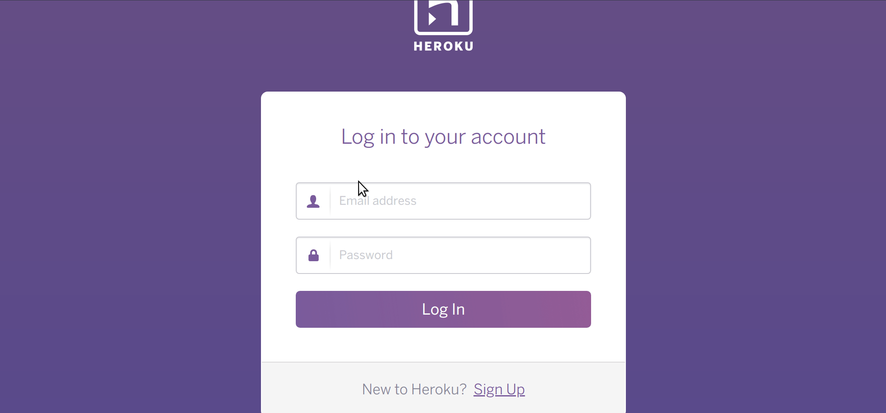

# passprotect-firefox

**Stop using bad passwords.**

## What is PassProtect?

PassProtect-firefox is a Firefox port of the
[PassProtect-chrome](https://github.com/OktaSecurityLabs/passprotect-chrome)
extension. These extensions test your passwords on whatever site you visit to
make sure they haven't appeared in a breached password list.

PassProtect works by binding itself to all `input` elements on the page of type
`password`. Whenever a user enters a new value into one of these
`input` elements, PassProtect will check the user's password against
the fabulous [Have I Been Pwned?](https://haveibeenpwned.com) API service to see whether or not
the user's password has been breached in the past.

Finally, if appropriate, PassProtect will inform the user that their credentials
were previously breached, give them some useful information, and ask them to
update their password as soon as they can to reduce the risk that their account
will be compromised.

PassProtect is a new, experimental way to proactively notify users about data
breaches and help casual web users play a more active role in protecting their
online accounts.

We believe that by informing and guiding users to reset their credentials when
necessary, we can all help make the web a safer place &lt;3

## How to Use PassProtect

At the moment you will need to load this as a temporary extension to Firefox,
following [this](https://developer.mozilla.org/en-US/docs/Mozilla/Add-ons/WebExtensions/Temporary_Installation_in_Firefox)
process.

Working on getting this onto addons.mozilla.org.

## Is PassProtect Secure?

**YES!**

PassProtect never sends or stores password information over the network. It uses
[k-Anonymity](https://www.troyhunt.com/ive-just-launched-pwned-passwords-version-2/)
to safely communicate your sensitive data over the internet without risk.

PassProtect is also completely free, open source, and maintained by [Andy March](https://twitter.com/andymarch). If you want to audit the source, or have
ideas about how to do things better, please open a
GitHub issue or [email me](mailto:andy.march@okta.com) directly.

## Are You a Developer?

Awesome! You might enjoy checking out [passprotect-js](https://github.com/oktasecuritylabs/passprotect-js), it's a
developer library that provides the same functionality for websites you're
building.

It's really awesome because by dropping a single `script` tag into your
websites you can instantly enable PassProtect's awesome password protection
functionality across your sites for all of your users. And it's even mobile
friendly!

## Changelog

**1.0**: September 4, 2019
    - Working port
